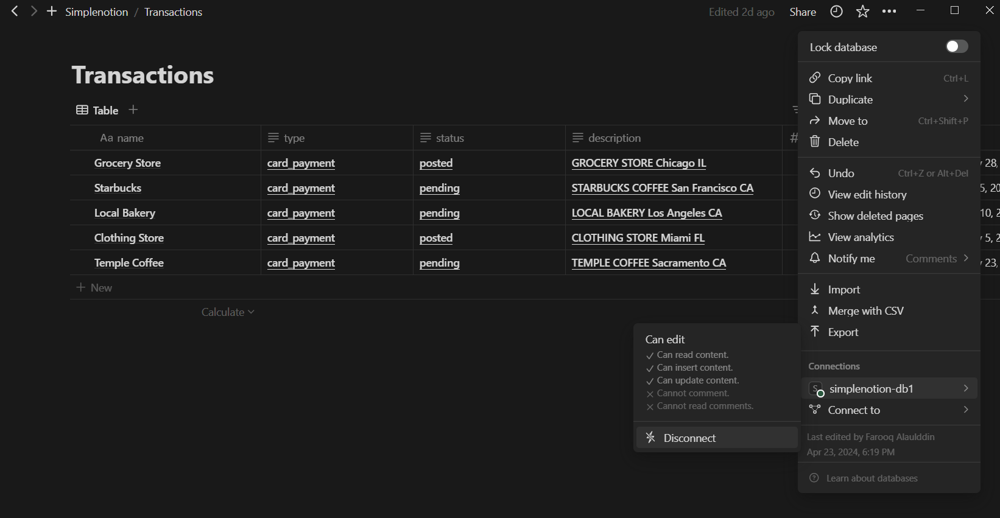

# simplenotion

Lightweight wrapper around notion native JavaScript SDK to make things a bit easier when connecting to your notion account. For now it only supports Database operations.

# Database Class

## 1 - Create Object of Database

Database constructor needs secret notion token () and database id (you can get this from url). Make sure that the database you want to access is shared with the integration you create.

    const database = new Database(NOTION_SECRET_TOKEN, SOME_DATABASE_ID);

### Integrations
- Create integration at https://www.notion.so/my-integrations. Once created, you can set the desired capabilities or the access level.
- Share the integration with the resources you want     

### Things to keep in mind

- As of now, it only support single database per object.
- You need to wait until database is ready

        await database.isReady().catch(e => console.log(e))

## 2 - insert
Insert array of rows or single row. Since notion does not support multiple eentries as of this library was created, `Promise.allSettled` is used. Other implementations might come later.

    database.insert([{}, {}, {}, ..]).then((res) => {
         console.log('Index then =>', res);
    }).catch((error) => {
         console.log('Index catch =>', error);
    });

## 3 - Query

### get
Similar to SQL Select

### where
To avoid complicated query objects, where is array of `'and' | 'or'` followed by `['Field', 'Database Filter', 'Field-Value']`

    database
    .query
    .get(['Name', 'Description'])
    .where(
        [
            'and',
                ['Description', 'contains', 'PAY'],
                ['Transaction Amount', 'greater_than', 500],
                'or',
                    ['Name', 'contains', 'Transaction 5'],
                    ['Name', 'contains', 'Transaction 6'],
        ],
    )
    .run().then((res) => {
        console.log(res);
    }).catch((err) => console.log(err))

Make sure to call run to execute query.

## 4 - Delete
WIP